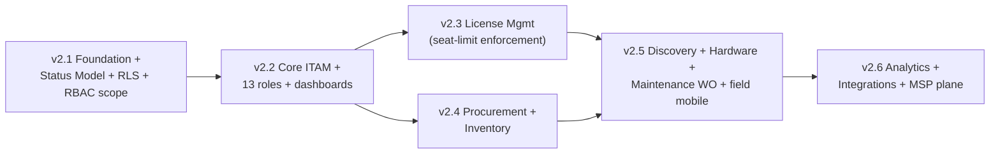

# TechpioAsset — v2.x Implementation Plan (from the v2.0 Blueprint)

> **Status:** Draft for team review.
> **Companion to:** the [`v2.0-blueprint`](./TechpioAsset-Enterprise-ITAM-Blueprint.pdf) release (BRD + FRD + Technical SRS).
> **Scope of this document:** how we take the **as-built v1** codebase to the **target-state v2** design **without regressing v1**, sequenced into shippable releases. It details the first release, **v2.1 (Foundation & Status Model)**, against real files, and outlines v2.2–v2.6.

This plan is deliberately grounded in the current code, not the blueprint's idealized model. Where the blueprint and the code disagree, the code wins as the starting point and the plan closes the gap.

---

## 0. How to read this

- **§1** states exactly where the code is today (verified, not assumed).
- **§2** is the engineering doctrine every release follows (preserve v1, expand/contract, flags, both-sides testing).
- **§3** maps the blueprint's six phases to versioned releases and to real code areas.
- **§4** is the actionable **v2.1** plan — workstreams, migrations, acceptance criteria (traced to QA-pack IDs), risks, estimate.
- **§5** outlines v2.2–v2.6 at milestone detail.
- **§6** is cross-cutting delivery (testing, CI gates, rollout safety).
- **§7** lists open decisions the team must make before v2.1 starts.

---

## 1. Starting point — as-built v1 (verified)

| Area | Today (v1) | Blueprint target (v2) | Gap |
|---|---|---|---|
| **Tenancy** | `companyId` on **90 models**; logical row isolation via a Prisma extension | Multi-tenant + MSP plane; **Postgres RLS** backstop; per-tenant unique keys | Add RLS + tenant/plane concepts (rename is cosmetic) |
| **Asset status** | single `AssetStatus` enum, **18 values** (`DRAFT…DISPOSED/DONATED`); separate `AssetCondition` enum already exists (`NEW GOOD FAIR POOR DAMAGED UNUSABLE`) | **4 orthogonal dimensions**: Lifecycle, Availability, Condition, Ownership | Add 3 new enums, keep Condition, backfill + compatibility |
| **RBAC** | `resource:action` permission strings (~48), 8 system roles, deny-by-default, `RolePermission`/`UserRole` joins | `module:resource:action` + **data scope** (ALL/DEPT/DIRECT_REPORTS/OWN), 13 roles/3 planes, custom roles, read-only Auditor invariant | Add scope column + taxonomy + roles (additive) |
| **State machines** | `packages/domain` pure state machines: `asset-status.ts`, `request-status.ts`, `maintenance-status.ts`, `verification-status.ts`, `workflow.ts` | One config-driven engine, guarded + audited transitions | Generalize incrementally; reuse existing tables |
| **Modules present** | assets, inventory, requests+approvals+workflow, invoices+PO+AI, maintenance+warranty+disposal, vendor, notifications, audit, physical-inventory, reports, mobile-sync | + License Mgmt, Procurement (RFQ/GRN/3-way match), Warehouse Inventory, Discovery, Analytics/MSP | New modules layered on existing spine |
| **Data model** | 57 models incl. `Vendor, PurchaseOrder, PurchaseOrderLine, Invoice, MaintenanceRecord, Warranty, DisposalRecord, AssetTransfer, AssetConditionLog, PhysicalInventorySession` | ~+50 entities (SeatPool, LicenseAssignment, GoodsReceipt, StockLevel/Movement, WorkOrder, HardwareProfile, …) | Extend, don't replace |
| **Migrations** | Prisma Migrate, timestamped dirs, `_init` baseline | same | Use **expand/contract** for every breaking change |
| **Clients** | Next.js 15 web (`apps/web`), Expo/RN mobile (`apps/mobile`), offline-sync engine (`packages/domain/offline-sync.ts`) | same, extended UIs | Both surfaces updated per change |
| **Tests** | 448 (296 unit + 152 integration); Playwright e2e scaffold | + the ~450-case [QA pack](./TechpioAsset-QA-Test-Pack.pdf) | Wire QA-pack cases into suites |

**Implication:** v1 already has the hard parts of the spine — deny-by-default RBAC, an audit ledger, workflow-as-data, offline-sync idempotency, a Condition enum, and a rich procurement/maintenance data model. v2 is mostly **additive extension + one careful status refactor**, not a rewrite.

---

## 2. Guiding principles (every release obeys these)

1. **No v1 regression.** Existing endpoints, screens, seeds, and the 448 tests stay green throughout. Any behavior change is opt-in behind a flag until cutover.
2. **Expand → migrate → contract.** Every schema change ships in three deploys: add new columns/tables (nullable/defaulted) → backfill + dual-write → remove the old only after the new is proven. Never a destructive single-step migration.
3. **Feature-flagged rollout.** New behavior gated by env/config flags (extend the existing `AIConfiguration`/settings pattern) so it can be enabled per environment, then per tenant.
4. **Defense in depth.** Tenant isolation and permission checks are enforced at the guard, the policy layer, **and** the DB (RLS) — never UI-only. (Blueprint SRS §1.6–1.8.)
5. **Both-sides testing (mandatory).** Every functional change is verified on **web AND mobile** (Expo Web as the laptop stand-in where no device is available) before a task is "done" — per the team testing policy. QA-pack `Surface` tags drive this.
6. **Domain-first.** Business rules land in `packages/domain` as pure, exhaustively-tested functions before the API/UI wire them up (the v1 pattern — keep it).
7. **One reversible migration per PR**, with a written rollback note.

---

## 3. Release map (blueprint phases → versions → code)

| Release | Theme (blueprint phase) | Primary code areas | Headline outcome |
|---|---|---|---|
| **v2.1** | Foundation & **Status-Model refactor** (Ph 0) | `prisma/schema`, `packages/domain/asset-status.ts`, `apps/api/src/{assets,lifecycle,auth,org}`, `apps/web`, `apps/mobile`, RLS | 4-dimension status live; RLS backstop; RBAC scope + Auditor invariant; **zero v1 regression** |
| **v2.2** | Core ITAM & RBAC completion (Ph 1) | `assets`, `requests`/`workflow`, `users`/`org`, dashboards | 13 roles + data scopes; asset detail tabs; role dashboards v1; approval SoD/escalation |
| **v2.3** | **License Management** (Ph 3 — pulled early, high value & self-contained) | new `license` module, `packages/domain/license.ts` | Seat pools + **transactional hard seat-limit enforcement**; reclaim/renewal |
| **v2.4** | Procurement & Warehouse Inventory (Ph 2) | extend `invoices`/PO into `procurement`; new `inventory` (stock/GRN/count) | PR→RFQ→PO→GRN→3-way match; stock levels, cycle count, stock→asset |
| **v2.5** | Discovery + Hardware detail + Maintenance work-orders (Ph 4 & 5) | new `discovery`, extend `maintenance` to work-orders; 7-tab hardware page; field mobile | Intune/agent ingest; health score; WO lifecycle + SLA; technician mobile |
| **v2.6** | Analytics, Integrations & MSP plane (Ph 6) | `reports`→analytics, `integrations`, Super-Admin/MSP | Exec dashboards, scheduled reports, SSO/SCIM/HRIS, cross-tenant control plane |

> Ordering note: the blueprint sequences License as Phase 3, but it is **small, self-contained, and the flagship differentiator**, so we pull it to **v2.3** right after the RBAC foundation it depends on. Procurement/Inventory (larger) follows in v2.4.



---

## 4. v2.1 — Foundation & Status Model (detailed)

**Goal:** land the load-bearing platform changes everything else depends on — the 4-dimension status model, the RLS tenant backstop, and the RBAC scope/invariant foundation — shipped behind flags with **zero v1 regression**.

### 4.1 In scope / out of scope

**In:** status-model schema + migration + domain + services + API + web + mobile; RLS backstop on `companyId`; `UserRole.scope` column + `module:resource:action` taxonomy alias + read-only Auditor invariant middleware; additive introduction of the new role records (mapped from the 8 existing). 
**Out (later releases):** new modules (License/Procurement/Inventory/Discovery), full 13-role dashboards, 7-tab hardware page, MSP plane. New roles are *created and mappable* in v2.1 but their module features arrive with their modules.

### 4.2 Workstream A — Status-model refactor (flagship)

**Target enums** (add to `schema.prisma`; keep `AssetCondition`, add a `ConditionGrade` alias mapping):

```
LifecycleState   : PLANNED IN_PROCUREMENT IN_STOCK DEPLOYED IN_MAINTENANCE RETIRED DISPOSED
AvailabilityState: AVAILABLE RESERVED ASSIGNED IN_TRANSIT IN_REPAIR LOST
OwnershipType    : OWNED LEASED RENTED BYOD LOANER
ConditionGrade   : (reuse AssetCondition; add END_OF_LIFE)
```

**Steps (expand/contract):**

1. **Expand.** Add `lifecycleState`, `availabilityState`, `ownershipType` columns to `Asset` (nullable first), plus the 3 new enums. Keep the legacy `AssetStatus` column. *(Migration 1, non-breaking.)*
2. **Domain.** Rewrite `packages/domain/asset-status.ts` into four small state machines + a `deriveDimensionsFromLegacy(status)` mapper (the blueprint Part 3 §1.5 table: e.g. `IN_USE→{DEPLOYED, ASSIGNED}`, `UNDER_REPAIR→{IN_MAINTENANCE, IN_REPAIR}`, `LOST/STOLEN→availability=LOST`). Add legal-combination guards (§1.4): `ASSIGNED ⇒ active AssetAssignment`; `RETIRED/DISPOSED ⇒ no new assignment`; location-XOR-user. Exhaustive unit tests first.
3. **Backfill.** Data migration writes the three dimensions for every existing `Asset` from its legacy status via the mapper; seeds a synthetic `AssetConditionLog`/lifecycle event where useful. *(Migration 2, data-only, reversible by dropping new columns.)*
4. **Dual-write.** In `apps/api/src/assets` + `apps/api/src/lifecycle`, every write that sets `AssetStatus` also sets the derived dimensions (and vice-versa) behind flag `STATUS_MODEL_V2`. Reads prefer dimensions when the flag is on.
5. **API.** Add dimensions to asset DTOs/contracts (`packages/contracts`), add multi-dimension filter params to the asset list endpoint (the flagship query: *leased + deployed + poor + Warehouse-BLR*). Legacy `status` stays in responses for back-compat.
6. **Web.** `apps/web` asset list + detail render four independent status chips and expose the 4 filters; keep a legacy-status column until v2.2.
7. **Mobile.** `apps/mobile` asset list/detail + scan result show the four chips; offline cache schema bumped (versioned) so `offline-sync.ts` handles the new fields.
8. **Contract (later).** Only after v2.2 proves the dimensions, mark `AssetStatus` deprecated; removal is a v2.3+ contract migration.

### 4.3 Workstream B — Tenant-isolation hardening (RLS)

- Enable Postgres **Row-Level Security** on the `companyId`-bearing tables; policy `companyId = current_setting('app.tenant_id')::uuid`.
- Set `app.tenant_id` per request in the Prisma middleware that already injects `companyId` (evolve, don't replace).
- Backstop only — the existing extension stays as the convenience layer; **no behavior change** expected, proven by the full v1 suite + new `TEN-###` cases.
- Audit per-tenant unique constraints (asset tag, serial, invoice/PO number) match the blueprint (`(companyId, …)`); add any missing partial-unique (e.g. serial `WHERE serialNumber IS NOT NULL`).

### 4.4 Workstream C — RBAC foundation

- Add `scope` (`ALL|DEPARTMENT|DIRECT_REPORTS|OWN`) to `UserRole` (default `OWN` = fail-closed); resolver in `packages/domain/permissions.ts`; wire into the repository-layer scope filter that already enforces employee isolation.
- Introduce a `module:resource:action` **alias** over the current `resource:action` strings (non-breaking; both resolve) to prepare the taxonomy.
- Add the **read-only Auditor invariant**: gateway middleware that rejects every `create|update|delete|approve|execute` for any role flagged `readonly` *before* permission resolution, with a standing test (blueprint Roles §3.1). The v1 Auditor role maps straight onto it.
- Seed the **13 role records** (mapped from the 8 — see blueprint Roles §1.4) as additive rows; new roles carry only the permissions whose modules exist today, expanding as modules ship.

### 4.5 Rollout & rollback

| Step | Deploy | Flag | Rollback |
|---|---|---|---|
| Expand schema (nullable dims, RLS policies off-enforcing) | 1 | — | drop columns; policies are permissive |
| Backfill dimensions | 1 (job) | — | dimensions unused while flag off |
| Enable dual-write + dimension reads | 2 | `STATUS_MODEL_V2=on` (per env→per tenant) | flip flag off → v1 behavior |
| Enforce RLS | 2 | `RLS_ENFORCE=on` | set policies permissive |
| Auditor invariant + scopes | 2 | `RBAC_SCOPES=on` | flag off → v1 permission behavior |

### 4.6 Acceptance criteria (traced to the QA pack)

- **Status model:** `AST-014…AST-027` (dimension independence + guardrails), `AST-051` (flagship multi-dimension query), `AST-042…AST-050` (append-only history, optimistic lock). All green on **web + mobile + API**.
- **Tenant isolation:** `TEN-001…TEN-015` (no cross-tenant read/write, RLS backstop, per-tenant unique keys, mobile sync/deep-link isolation).
- **RBAC:** `RBAC-001/002` (deny-by-default, missing-scope→OWN), `RBAC-003/004` (OWN scope + IDOR), `RBAC-017/018/019` (Auditor read-only invariant, incl. mobile), `RBAC-022/023` (no self-escalation, no `platform:*`).
- **Regression:** all 448 existing tests green; no change to v1 API response shapes (legacy `status` still present).

### 4.7 Definition of Done (v2.1)

Schema migrations reversible and applied on a prod-shaped DB; backfill verified on a copy of prod data; flags default **off** in prod; the QA-pack cases above pass on web + mobile + API; 448 v1 tests green; docs updated; a demo shows the flagship four-dimension filter on both clients.

### 4.8 Risks & mitigations

| Risk | Mitigation |
|---|---|
| Backfill mis-maps a legacy status | Mapper is pure + unit-tested against all 18 values; backfill runs on a prod copy first; dimensions unused until flag on |
| RLS breaks a raw query / migration path | Enforce behind `RLS_ENFORCE`; run full suite with it on in CI; policies permissive as instant rollback |
| Dual-write drift (status vs dimensions) | Single source-of-truth writer in the service layer + an invariant test asserting derived == legacy |
| Mobile offline cache schema change | Version the local store; `offline-sync.ts` migration + a forced resync path; covered by `SYNC-###` cases |
| Scope regression hides data a user should see | `RBAC_SCOPES` flag; scope defaults to today's effective behavior per role until validated |

### 4.9 Rough size

Foundation-heavy, one squad: **~6–9 engineer-weeks** (A ≈ 3–4, B ≈ 1–2, C ≈ 2–3, incl. tests on both surfaces). No new user-facing modules, so UI cost is confined to status chips/filters on existing screens.

---

## 5. v2.2 – v2.6 (milestone outlines)

- **v2.2 Core ITAM & RBAC completion** — finish the 13 roles + data scopes end-to-end; asset-detail tabs; role dashboards v1 (web + mobile); approval SoD/delegation/escalation on the existing workflow engine. QA: `RBAC-005…016/024…030`, `APR-*`, `AST-028…041`.
- **v2.3 License Management** — new `license` module + `packages/domain/license.ts`; SeatPool/LicenseAssignment/LicenseKey/Renewal entities; **transactional seat-limit enforcement** (serializable guarded decrement), bulk/transfer/reclaim, renewal/expiry jobs. QA: `LIC-*`, `HW-004/017`. Flagship demo: the blocked 11th seat on web **and** mobile.
- **v2.4 Procurement & Inventory** — extend PO/invoice into full `procurement` (PR→RFQ→award→PO→GRN→3-way match, budget gate); new `inventory` (locations, stock levels, reservations, cycle count, stock→asset). QA: `PRC-*`, `INV-*`.
- **v2.5 Discovery + Hardware + Maintenance WO** — `discovery` connectors (Intune/agent) + reconciliation; 7-tab hardware page + health score; upgrade `maintenance` to the full work-order lifecycle with SLA timers + technician mobile. QA: `HW-*`, `MNT-*`.
- **v2.6 Analytics + Integrations + MSP** — analytics/exec dashboards + scheduled-report runner (the v1 gap); SSO/SCIM/HRIS/ERP integrations hub; Super-Admin cross-tenant plane + tenant provisioning/billing. QA: `NFR-*`, `AUD-*`, `TEN-014`.

---

## 6. Cross-cutting delivery

- **Testing.** Each release wires its QA-pack section into CI: pure rules → `packages/domain` unit tests; API cases → integration; UI/E2E → Playwright (web) + Detox/Maestro (mobile). **Every functional case runs on both surfaces** (or a mobile twin). Security cases (`AUTH/RBAC/TEN`) are release-blocking regardless of severity math.
- **CI gates.** `pnpm verify` (format→lint→typecheck→test) stays the pre-commit gate; add a migration-reversibility check and an RLS-on integration lane.
- **Data safety.** Every migration rehearsed on a prod-shaped dataset; expand/contract only; backfills idempotent and re-runnable.
- **Observability.** Add trace correlation (blueprint SRS §1.15) opportunistically as modules land; not a v2.1 blocker.
- **Docs.** Update `README.md` and `PLAN.md`; each release appends a short `docs/phase-*`-style report, consistent with v1.

---

## 7. Open decisions (resolve before v2.1 kickoff)

1. **`companyId` → `tenantId` rename?** Cosmetic but touches 90 models. Recommend **defer** (alias in code) to avoid churn; revisit at v2.6 MSP work.
2. **Keep `AssetStatus` how long?** Proposal: through v2.2, deprecate in v2.3, remove in v2.4.
3. **RLS rollout unit** — per-env first, then per-tenant? Recommend env→canary tenant→all.
4. **New-role introduction** — create all 13 now (additive) vs. only as modules ship? Recommend **create now**, gate features by module.
5. **Mobile test harness** — Detox vs Maestro, and can we get one physical Android device / emulator into CI (a known v1 gap)?

---

*Draft prepared from the v2.0-blueprint. Grounded in the current `apps/api/prisma/schema.prisma`, `packages/domain`, and the seeded permission/role model. Revise §4 scope with the team, then this becomes the working plan for the v2.1 branch.*
